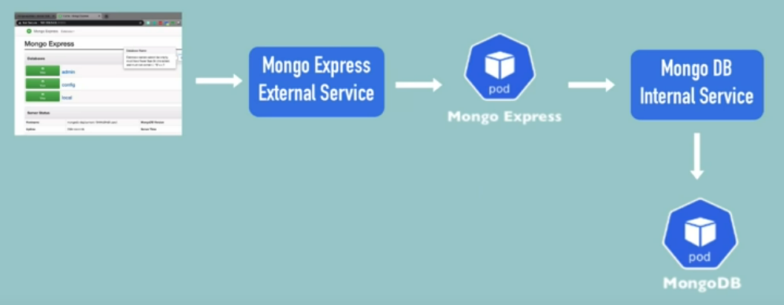

# Prerequisites
<ol>
  <li>Minikube installed</li>
  <li>Kubectl installed</li>
</ol> 

# Kubernetes_Demo_Project
This is my first demo project using kubernetes.

I created a MongoDB Pod and connected it to a an internal service. 
Second pod is a a MongoExpress Pod which connects to the MongoDB Pod via the internal service and to the browser via an external service. 
The DB URL is stored in a ConfigMap.
The DB Username, DB Password are stored in a Secret.




First create the cluster 
```bash
minikube start 
```
Start by creating the secret to store the database credentials:
```bash 
kubectl apply -f mongo-secret.yaml
```
Now we create the MongoDB Pod and its service and reference the secret inside it to get the credentials
```bash 
kubectl apply -f mongoDB.yaml
```
Then we create the config map that will store the database url which is nothing else but the service attached to the monogoDB database. 
```bash 
kubectl apply -f mongo-configmap.yaml
```
Next we create the mongo-express deployment and its external service. The yaml file references the mongo-secret and the mongo-configmap that's why we need to create them before. 
```bash 
kubectl apply -f mongo-express.yaml
```
Finally exectue the following command so that minikube assigns an external-IP to the external service and you can access it via the browser
```bash 
minikube service mongo-express-service
```
This project was conducted following tis [YouTube Tutorial](https://www.youtube.com/watch?v=X48VuDVv0do)
